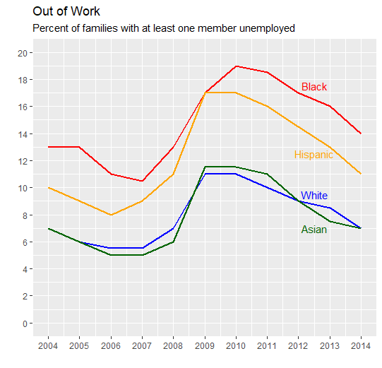
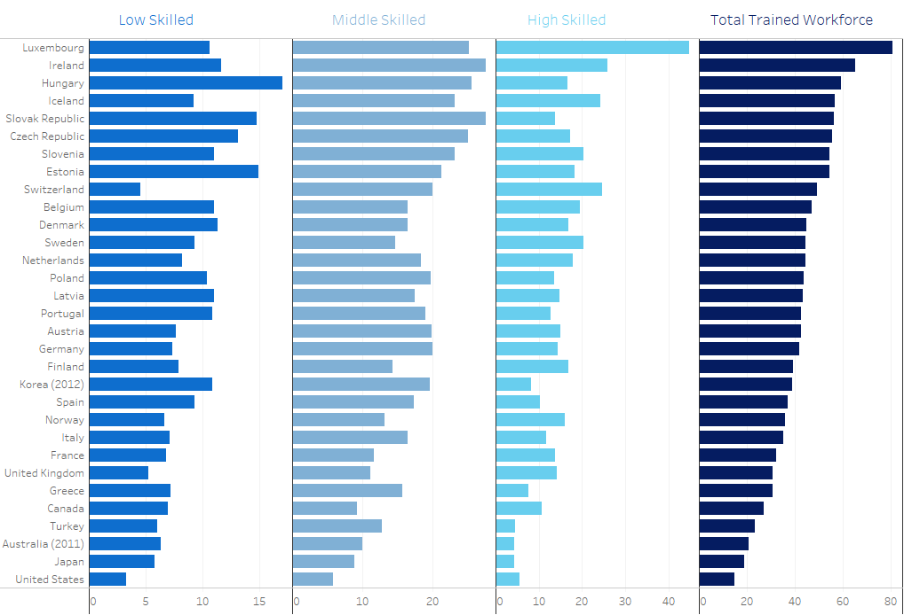

### Homework 3:Re-create Charts

### Pre-requisites:

The goal of this assignment is to give you experience with multiple visualization tools by re-creating two existing charts as closely as possible. This includes colors, fonts, and any text elements. For each chart, there's an article describing the chart (most are re-makes of other charts) and an Excel data file.

Choose one chart from Part 1 and one chart from Part 2. The two charts you re-create must use different idioms and must be created using different tools. Extra credit will be given for excellent re-creations that use R or Vega-Lite.

### Part 1 - Choose one chart, can use Excel, Tableau, R, or Vega-Lite

||article: [Remake: Paired Column Chart from WSJ](https://policyviz.com/2018/03/01/remake-paired-column-chart-from-wsj/) Excel data file: [PolicyViz_WSJ_Remake.xlsx](http://policyviz.com/wp-content/uploads/2018/02/PolicyViz_WSJ_Remake.xlsx)|
|--|--|

#### Below is the output image :

### Line chart 1 

||
|--|

### Steps for re-creating the above chart

I used RStudio to re-create this chart.Firstly,i downloaded the excel data from the git hub link and loaded that excel file into R studio and i have written the below code to re-create the chart :

    library(tidyverse)
    library(ggplot2)
    library(ggrepel)
    library(ggtext)

    data("PolicyViz_WSJ_Remake")
    View(PolicyViz_WSJ_Remake)

    # Create the data for the chart.
    Year <- c(2004,2005,2006,2007,2008,2009,2010,2011,2012,2013,2014)
    White <- c(7,6,5.5,5.5,7,11,11,10,9,8.5,7)
    Black <- c(13,13,11,10.5,13,17,19,18.5,17,16,14)
    Asian <- c(7,6,5,5,6,11.5,11.5,11,9,7.5,7)
    Hispanic <- c(10,9,8,9,11,17,17,16,14.5,13,11)

    #Data label names
    asian <- c("","","","","","","","Asian", "", "", "")
    white <- c("","","","","","","","", "White", "", "")
    hispanic <- c("","","","","","","","", "", "Hispanic", "")
    black <- c("","","","","","","","", "", "", "Black")

    #Creating the data frame
    data <- data.frame(Year,White,Black,Asian,Hispanic)

    #Plotting the graph
    ggplot(data, aes(x = Year, y = -2 )) +
      geom_line(aes(y = White), colour = "blue",size=0.75) +
      geom_line(aes(y = Black), colour = "red",size=0.75) +
      geom_line(aes(y = Asian), colour = "darkgreen",size=0.75)  +
      geom_line(aes(y = Hispanic), colour = "orange",size=0.75)+
      geom_line() + scale_x_continuous(name="", labels=as.character(Year),breaks=Year) +
      geom_line() + scale_y_continuous(name="", breaks=c(0,2,4,6,8,10,12,14,16,18,20), limits = c(0,20))+
     ggtitle("Out of Work",
          subtitle = "Percent of families with at least one member unemployed")+
      geom_text(label=asian,x=2012.5, y=7 , color = "darkgreen")+
      geom_text(label=white,x=2012.5, y=9.5 , color = "blue")+
      geom_text(label=hispanic,x=2012.5, y=12.5 , color = "orange")+
      geom_text(label=black,x=2012.5, y= 17.5 , color = "red")
      
I have re-created complete chart using RStudio and i have taken the code reference from the internet which i have mentioned in the references section.I used line chart to represent the data because i have being asked to compare unemployment rates within and between four different racial/ethnic groups between 2004 and 2014. It’s hard to do either of these tasks because there are just so many columns.Representing it by line chart is more approriate for the given data as it gives better understanding for data visualization.

### Part 2 - Choose one chart, can use Tableau, R, or Vega-Lite (no Excel)

*Remember that you must choose a different tool and different idiom than you chose for Part 1.*

#### Small Multiples Bar chart
||article: [Remaking an OECD Stacked Bar Chart](https://policyviz.com/2017/11/30/remaking-oecd-stacked-bar-chart-general-comments/) Excel data file: [PolicyViz_OECD_Skills_Data.xlsx](http://policyviz.com/wp-content/uploads/2017/11/PolicyViz_OECD_Skills_Data.xlsx)|
|--|--|

#### Below is the output image :

#### Small Multiples Bar chart

||
|--|

### Steps for re-creating the above chart

I used Tableau for this chart.Firstly,i downloaded the excel data from the git hub link and loaded that excel file into Tableau.Then, i have selected countries names table which is F2 table in this data and dropped it in the rows section.After that i have selected Measure Names Table and Measure values attribute and dropped them in the columns section.I have filtered the attributes in the measure values to get the output i desire.Attributes which are present in the Measure Values are Low skilled,Medium Skilled,High Skilled and total.Then i have dropped the Measure Names Table in the color section which is present in the Marks in order to change the colors of the attributes which are present in Measure Values.After that i have rearranged and sorted the Measure Values attributes in the chart according to the given chart in order to recreate the same chart.I have changed the sheet 1 name as Remaking an OECD stacked Bar chart.

I have re-created the complete chart using Tableau.I used Bar Chart to represent the data as it gives better understanding in the data visualization.Break up the chart into four charts. I put each individual skills series on its own vertical axis, and then, to maintain the ability to compare the totals.For this Bar chart is more flexible and better understanding when we view the data.

### References

* https://rstudio-conf-2020.github.io/r-for-excel/ggplot2.html
* https://www.statology.org/aesthetics-must-be-either-length-1-or-same-as-data/
* https://policyviz.com/2017/11/30/remaking-oecd-stacked-bar-chart-general-comments/
* https://policyviz.com/2018/03/01/remake-paired-column-chart-from-wsj/
