```{r setup, include=FALSE}
knitr::opts_chunk$set(echo = TRUE)
```

## Part 1

__Q. Use dataset 1 to create a chart to answer the question, "How has the weekly rate of COVID-19 cases in Virginia changed over time based on vaccination status?". (Though I'll use cases here, you may show cases, hospitalizations, or deaths.)__
\

The dataset provided contains information on COVID-19 cases in various locations in Virginia, including infections, deaths, and hospitalizations. The data is sorted based on the vaccination status of individuals, which is classified as "Fully Vaccinated," "Partially Vaccinated," or "Unvaccinated." The dataset also includes data on different health regions, including the "Central Region," "Eastern Region," "Northern Region," "Northwest Region," and "Southwest Region." To analyze the trend of COVID-19 cases in Virginia over time based on vaccination status, the dataset needs to be cleaned first. OpenRefine is used to clean the dataset, as indicated below.

##### Data cleaning using OpenRefine
\

 We will first load the given dataset and choose to parse any number value to number type instead of text type.
 
Then i choose edit cells  for the Report Date column and selected common transforms to convert into to date.Now, as per the requirements in the question, the rate_per_100k needs to be calculated using the formula, rate_per_100k = (cases / population_denominator) * 100000.I have added Rate column to the data by selecting edit column cells to add new column named rate and using the below code: 
\
```round(((cells['Infections'].value + cells['Deaths'].value + cells['Hospitalizations'].value)/(cells['Population Denominator'].value * 1.0))* 100000)```
\

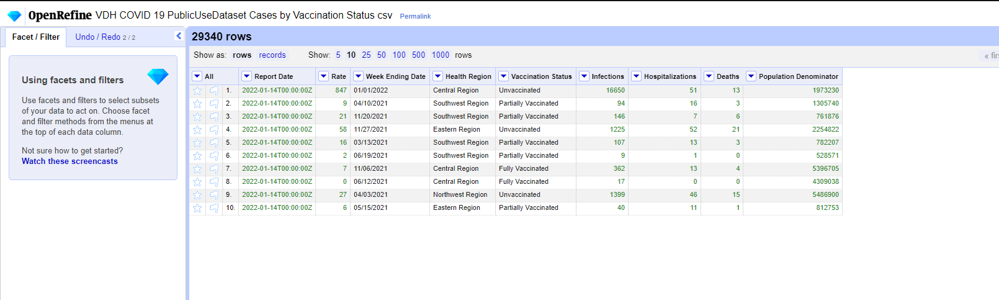


This excel data is then exported and used in Tableau.

\
For plotting the required chart analyzing how the weekly rate of COVID-19 cases in Virginia changed over time based on vaccination status. In the given dataset *Report Date* and *Week Ending Date* are ordinal attributes, and the *Health Region* and *Vaccination Status* are Categorical Data, and *Overall Case Rate* is the quantitaive data that we will be using for the visualization. \

For Month week ending date vs rate :

I have selected "Week ending date" table and dropped in columns section and "rate" attribute in rows section.After that i have dropped vaccination status table in color marks.

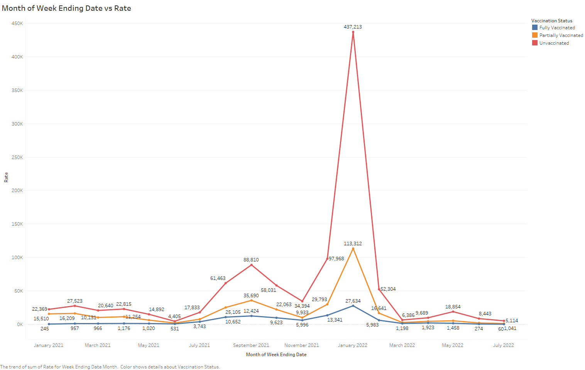

\
To visualize the given information, we will be using the *week ending date*, and *Vaccination Status*. Since in this we have one quantitative value attribute and one ordered key attribute, we will be using a line chart. The categorical attribute of Vaccination Status will be used to plot the multiple lines in the chart. In tableau, the column is *week ending date* which is ordered across Month, Year and the row is *Sum(Rate)*. The *Vaccination Status* is used for the multiline and the channel used is Color. I also used Dots as marks for indicating the each point on the line. 
\

For Month of report date vs rate:

I have selected "Report Date" table and dropped in columns section and "rate" attribute in rows section.After that i have dropped vaccination status table in color marks.

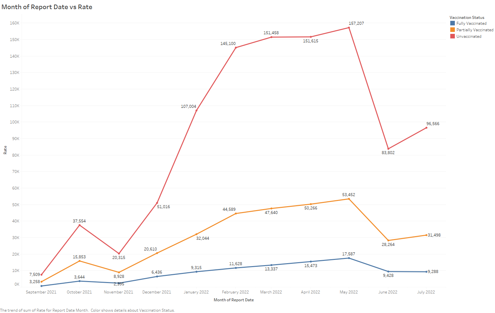

\
To visualize the given information, we will be using the *report date*, and *Vaccination Status*. Since in this we have one quantitative value attribute and one ordered key attribute, we will be using a line chart. The categorical attribute of Vaccination Status will be used to plot the multiple lines in the chart. In tableau, the column is *report date* which is ordered across Month, Year and the row is *Sum(Rate)*. The *Vaccination Status* is used for the multiline and the channel used is Color. I also used Dots as marks for indicating the each point on the line. 
\

##### Analysis of the Visualization
\

By using lines and dots as marks in the above graphs and color as the channel we are able to comprehend the pattern in the cases for different vaccination status over a period of time. In the chart one can analyze that the cases are always the highest for Unvaccinated patients and the lowest for Vaccinated patients. This means that the vaccination was actually preventing the infection of Covid 19. 
\

## Part 2

__Q. For each health district in Virginia, what proportion of all 1st doses were of the Pfizer vaccine?__
\

The given dataset includes Administration Date, FIPS, Locality, Health District, Facility Type, Vaccine Manufacturer and Dose Number. In order to understand the the total number of 1st dose vaccines administered in each health district based which are Pfizer, we must first clean the data.
\

#### Data cleaning using OpenRefine


We will first load the given dataset and choose to parse any number value to number type instead of text type.

Firstly, I have selected "Health District" column and then i removed the rows related to "Not Reported" and "Out of State" as only Virginia state data is required.

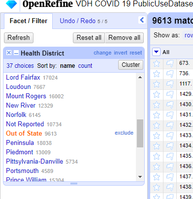

Then, i have selected "dose number" column and removed all the rows related to dose 2 to 6 as only dose 1 data is required.

Below is the screenshot of all doses data before cleaning:

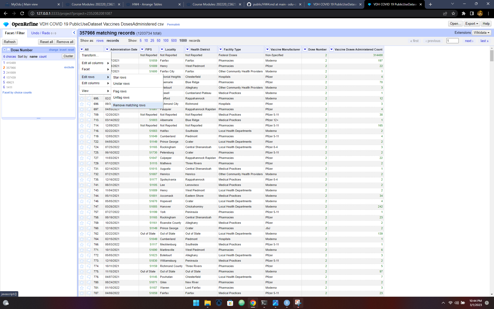

Below is the screenshot of dose 1 data after cleaning:

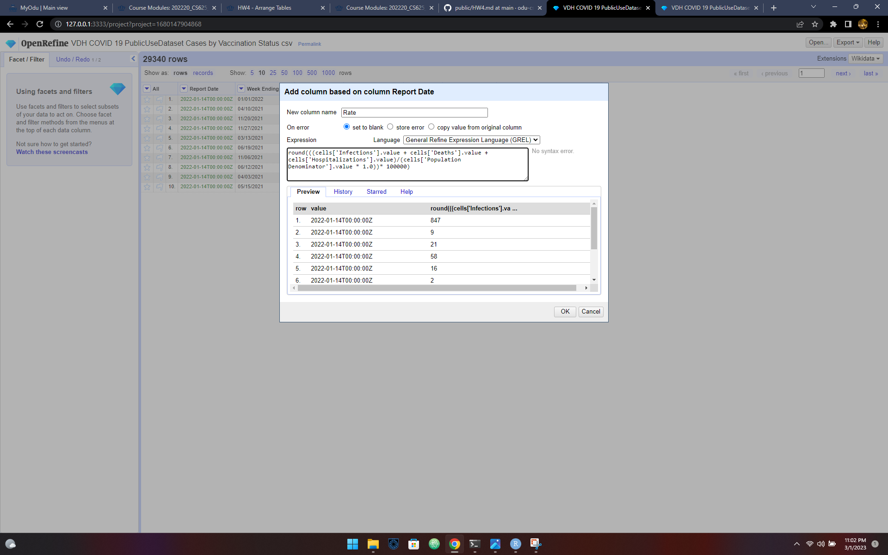

After this i have cleaned pfizer vaccine data and named all the pfizer name as same.

Below is the screenshot for pfizer data before cleaning:

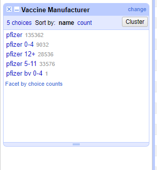

Below is the screenshot for pfizer data after cleaning:

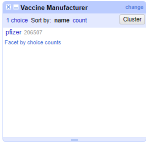


This data is now exported and used in tableau.

##### Data Processing
\

The information must be categorized into two groups. The first group should be based on the Health District and the total count of administered vaccine doses, while the second group should be based on the Health District, the total count of administered vaccine doses, and only include vaccines from the Pfizer manufacturer.
\

The csv data is loaded using the pandas library. This data is first grouped by 'Health District' and summed using 'Vaccine Doses Administered Count'.

\
```
import pandas as pd
vaccineData = pd.read_csv("CleanDataset2.csv")
allGroupData = vaccineData.groupby(['Health District'])['Vaccine Doses Administered Count'].sum()
print(allGroupData)
```
\

Then we need to extract data that have the 'Vaccine Manufacturer' as 'pfizer'. This data is then again grouped in the same fashion as above.
\
```
pfizerData = vaccineData[vaccineData['Vaccine Manufacturer'] == 'pfizer']
pfizerGroupData = pfizerData.groupby(['Health District']).agg(pfizer_manufacturer=('Vaccine Doses Administered Count', 'sum')).reset_index()
print(pfizerGroupData)
```
\
The two sets of data need to be linked together to obtain the total number of vaccinations and the number of Pfizer vaccinations in each Health district. This can be achieved using Python's merge function.
\
```
finalMergedData = pd.merge(allGroupData, pfizerGroupData)
finalMergedData['pfizer_propotion'] = (finalMergedData['pfizer_manufacturer'].astype(int) / finalMergedData['all_manufacturer'].astype(int)) * 100
print(finalMergedData)
finalMergedData.to_csv('MergedDataset2.csv')
```
This csv data is then used in Tableau. All the above code is executed in the given Google Colab Notebook.

[Google Colab Notebook](https://colab.research.google.com/drive/1MqtKtwCeE7qu0l7ZcmSY9SiUlDrSur7X?usp=sharing)

##### Data Information
\

Once the data has been processed, we can calculate the percentage of vaccine doses that were administered by Pfizer and other manufacturers in each Health district. We will then use Tableau to create a grouped or side-by-side bar chart. The dataset includes Health District as a categorical variable and the number of Pfizer and other vaccines administered as quantitative variables, where the total of both will be 100%. As we have one categorical variable and one quantitative variable, we can create a bar chart with multiple columns and then a stacked chart to display the proportions.

\

For Proportion of 1st dose being pfizer to other vaccines :

The data has been uploaded to Tableau, we will begin by placing the "Health District" variable in the Column section. Next, we will move the "Measure Values" variable to the Rows section and select only "Pfizer Vaccine" and "Other Vaccine". We will then move the "Measure Names" variable to the "Color" mark and select only "Pfizer Vaccine" and "Other Vaccine" to create either a Side-by-Side Bar chart or a Grouped Bar chart.

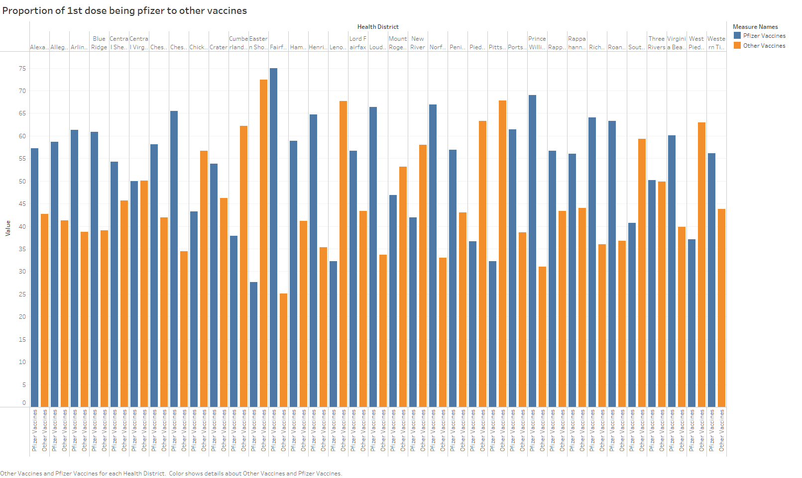

The Stacked Bar Chart provides an excellent visual representation of the proportion of Pfizer vaccines compared to the total and the proportion of other vaccines in each Health District. The chart uses bars as marks, with color and height as the channels. By examining the chart, we can conclude that the Health District "Fairfax" has the highest proportion of Pfizer vaccines compared to any other Health District, while "Eastern Shore" has the lowest proportion.

## Part 3

__Q. Propose two questions that require data from dataset 1 and dataset 2 to be combined to answer. Describe what data manipulation would need to be done to answer each question. Sketch a chart that could be used the answer each question. Justify your visualization idiom choice.__
\

_Q1. How the total number of cases and vaccination doses are evolving across various health regions over a particular duration of time._

\

The first dataset provides data on the number of infections, hospitalizations, and deaths reported in a specific region. The second dataset provides data on the number of vaccinations, but only at the level of Health Districts and Localities. It is important to note that the regions in the first dataset are categorized as Health Regions, which are the outermost region, containing Health Districts, which in turn consist of Localities. In contrast, the second dataset only provides information at the level of Health Districts and Localities.

\

To create this graph, we need to calculate the total number of cases (Infections + Hospitalizations + Deaths) for each Health Region every month, based on the first dataset. In the second dataset, we need to analyze each Health District and assign it to its corresponding Health Region, and then calculate the total number of vaccination doses for each region every month. To visualize this data, we will create a side-by-side multi-line chart.

An example chart is as shown below:

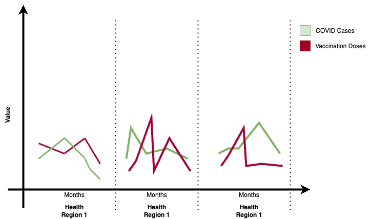

The multi-line chart provides insights into how the vaccination efforts are reducing the number of COVID cases and how the vaccination doses are distributed across different regions. It may also be useful to analyze individual vaccine manufacturers to determine which vaccine is most effective in reducing COVID cases.

\

_Q2. How the total number of cases and vaccination doses are fluctuating across various health regions during a specific time frame._

\

By using dataset1 and dataset2 to analyze the availability of Covid Vaccines in different Health Regions. When we say "availability," we are referring to the number of vaccination facilities in each region and the number of vaccination doses given by each facility. To obtain the "Health Region" data, dataset2 needs to be processed using the "Health District" information. Since the result would be a count of facilities in each region, which includes one categorical data and two quantitative data, a side-by-side bar chart would be a suitable solution. This method allows us to compare the number of facilities in each region and investigate any relationship between the number of facilities and the number of vaccination doses administered.A sketch of the graph could be as below:

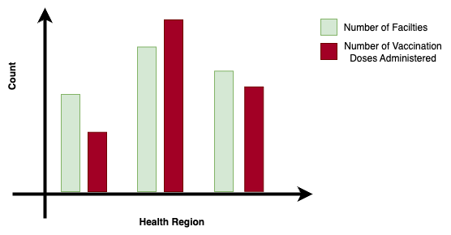

\

## References

* Tableau Tutorial, [https://www.tutorialspoint.com/tableau/index.htm](https://www.tutorialspoint.com/tableau/index.htm)
* Stacked Bar in Tableau, [https://hevodata.com/learn/stacked-bar-charts-in-tableau/](https://hevodata.com/learn/stacked-bar-charts-in-tableau/)
* Creation of Group Chart, [https://kb.tableau.com/articles/howto/creation-of-a-grouped-bar-chart](https://kb.tableau.com/articles/howto/creation-of-a-grouped-bar-chart)
* Pandas Merge Function, [https://pandas.pydata.org/docs/reference/api/pandas.merge.html](https://pandas.pydata.org/docs/reference/api/pandas.merge.html)
* Export Views in Tableau, [https://help.tableau.com/current/pro/desktop/en-us/save_export_image.htm](https://help.tableau.com/current/pro/desktop/en-us/save_export_image.htm)