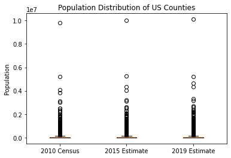
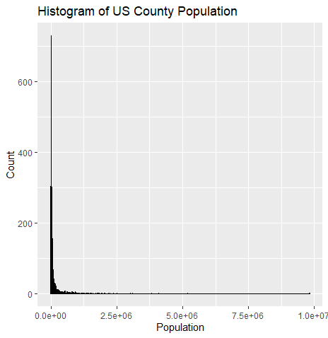
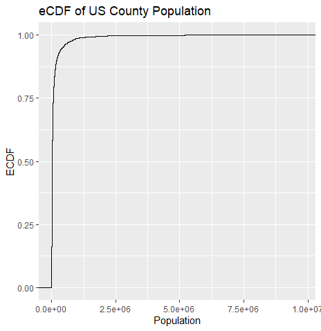
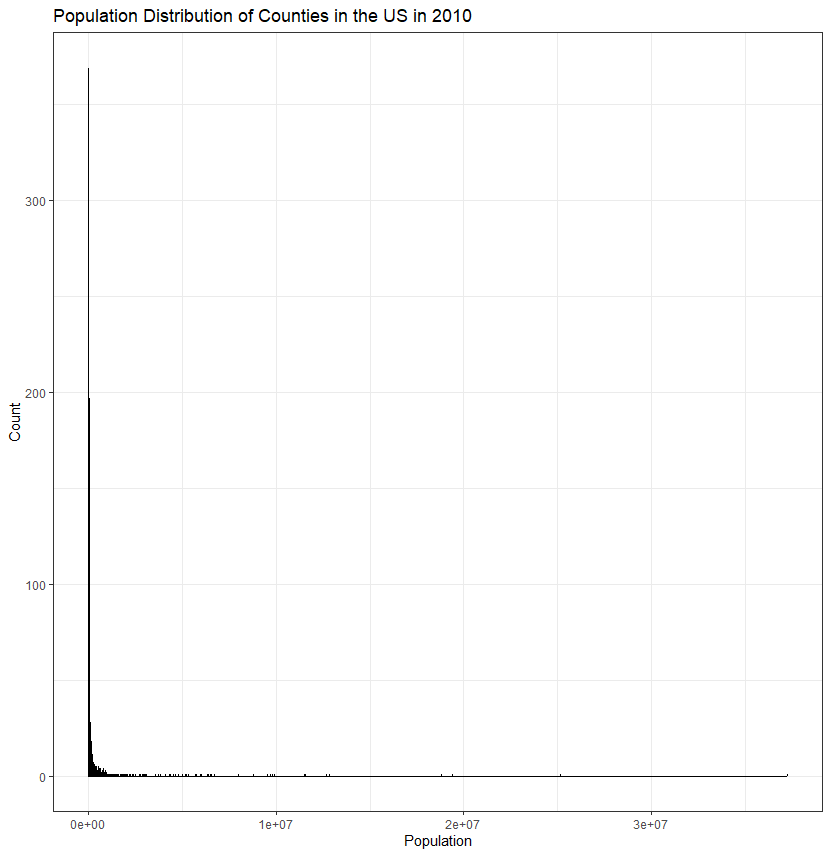
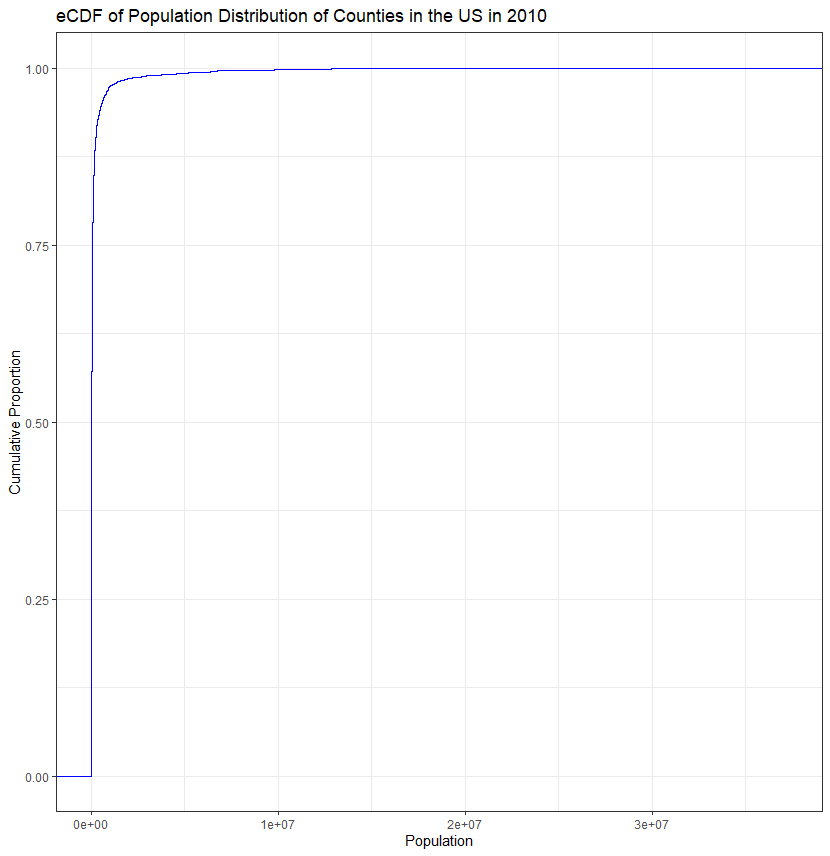
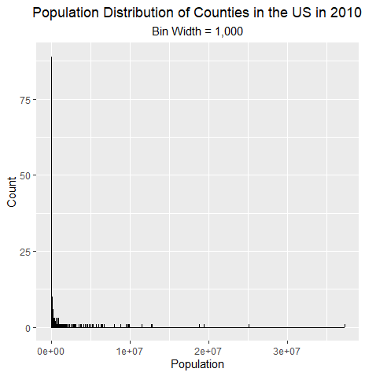

HW 5, CS 625, Spring 2022
================
Emmanuel Prem Kumar Gullipalli
Mar 22, 2023

The goal of this assignment is gain experience creating distribution
charts (histogram, eCDF, boxplot) and using them to help guide further
analysis of the underlying data.

## Assignment

### Part 1: Create Distribution Charts

### Data Manipulation

Before creating the charts, I needed to extract the necessary columns
from the dataset. I used the python code to extract the relevant columns
(CENSUS2010POP, POPESTIMATE2015, and POPESTIMATE2019) and saved them in
a separate CSV file named “county_population.csv” file.I have written
this python code in Google Colab Notebook.

[Google Colab
Notebook](https://colab.research.google.com/drive/1MXrnHf9mBXdB6KHIPoyu6YHzVgEVCjDx?usp=sharing)

### Boxplot

The following boxplot shows the distribution of the population of all
counties in the US as of the 2010 Census, the 2015 estimate, and the
2019 estimate.

I created this plot using Python and the matplotlib library. Below is
the code snippet that i have written in Google Colab Notebook.

[Google Colab
Notebook](https://colab.research.google.com/drive/1K4zdqZB0VtQ3Jjqo_bs4TkC168rywr1g?usp=sharing)

### Advantages and Disadvantages

The boxplot is useful for showing the distribution of data and
identifying outliers. However, it does not show the exact values of the
data points and may not be as visually intuitive as other plots.

### Observations

- The population distribution of US counties is positively skewed, with
  a long tail towards the right.

- The median population has increased from the 2010 Census to the 2019
  estimate.

### eCDF and Histogram

The following eCDF and histogram show the distribution of the population
of all counties in the US as of the 2010 Census.

    library(ggplot2)

    df <- read.csv('county_population.csv')
    ggplot(df, aes(x=POP_2010)) + 
    stat_ecdf() + 
     labs(title='eCDF of US County Population', x='Population', y='ECDF') 

    ggplot(df, aes(x=POP_2010)) + 
    geom_histogram(binwidth=10000, fill='steelblue', color='black') + 
    labs(title='Histogram of US County Population', x='Population', y='Count')

### Advantages and Disadvantages

The eCDF is useful for showing the cumulative distribution of the data
and identifying percentiles. The histogram is useful for showing the
distribution of the data in bins. However, both plots can be affected by
the choice of bin size, and the eCDF can be difficult to interpret for
large datasets.

### Observations

- The majority of US counties have a population less than 100,000.
- There are a few counties with a population greater than 1 million.

### Part 2: Further Analysis

I used the charts that i have created in Part 1 to guide further
investigation of the data.

### Analysis: Population Distribution of Counties in the US in 2010

For this analysis, I will use the histogram and eCDF created in Part 1
to investigate the population distribution of counties in the US in
2010.

### Data Manipulation:

No data manipulation is needed for this analysis.

### Charts Created:

Histogram of population distribution of counties in the US in 2010:

    library(ggplot2)
    library(dplyr)

    # Load data and filter to only include 2010 Census population column
    county_pop <- read.csv("co-est2019-alldata.csv", header = TRUE, encoding = "UTF-8")
    county_pop_2010 <- county_pop %>% select(CENSUS2010POP)

    # Create histogram
    ggplot(county_pop_2010, aes(x = CENSUS2010POP)) +
    geom_histogram(binwidth = 5000, color = "black", fill = "blue") +
    labs(title = "Population Distribution of Counties in the US in 2010",
       x = "Population",
       y = "Count") +
    theme_bw()

eCDF of population distribution of counties in the US in 2010:

    library(ggplot2)
    library(dplyr)

    # Load data and filter to only include 2010 Census population column
    county_pop <- read.csv("co-est2019-alldata.csv", header = TRUE, encoding     = "UTF-8")
    county_pop_2010 <- county_pop %>% select(CENSUS2010POP)

    # Create eCDF
    ggplot(county_pop_2010, aes(x = CENSUS2010POP)) +
     stat_ecdf(geom = "step", color = "blue") +
    labs(title = "eCDF of Population Distribution of Counties in the US in 2010",
       x = "Population",
       y = "Cumulative Proportion") +
    theme_bw()

### Advantages and Disadvantages of Histogram and eCDF for this Distribution:

The histogram is useful for showing the frequency distribution of the
population of counties in the US in 2010. It allows us to see the shape
of the distribution and identify any potential outliers. However, the
bin width can significantly impact the appearance of the distribution
and the conclusions drawn from it.

The eCDF is useful for showing the cumulative proportion of counties by
population size, allowing us to see the percentage of counties with a
population less than or equal to a given value. However, the eCDF does
not show the shape of the distribution and can be difficult to interpret
without a corresponding histogram.

### Observations:

The population of counties in the US in 2010 is highly skewed to the
right, with the majority of counties having a population less than
50,000. There are a small number of counties with a very large
population, including some with populations greater than 1 million.

### Further Analysis:

To investigate the distribution in more detail, I will create additional
histograms with different bin widths.

### Create histogram with smaller bin width

    ggplot(county_pop_2010, aes(x = CENSUS2010POP)) +
    geom_histogram(binwidth = 1000, color = "black", fill = "blue") +
    labs(title = "Population Distribution of Counties in the US in 2010",
       subtitle = "Bin Width = 1,000",
       x = "Population",
       y = "Count") +
    theme(plot.title = element_text(hjust = 0.5),
        plot.subtitle = element_text(hjust = 0.5))
        

This code uses the ggplot library in R to create a histogram of the
population distribution of counties in the US in 2010, with a bin width
of 1,000. The aes function is used to specify the variable to be plotted
(CENSUS2010POP), and the geom_histogram function is used to create the
histogram itself. The labs function is used to add a title and subtitle
to the plot, as well as labels for the x and y axes. Finally, the theme
function is used to center the title and subtitle horizontally.

### Advantages:

The histogram provides a clear visualization of the distribution of
population in the counties of the US in 2010, with a bin width of 1,000.
The histogram is easy to understand, as it shows the number of counties
falling into each population range.

### Disadvantages:

The histogram does not take into account the size of the counties or
their population densities, which could affect the interpretation of the
results. The choice of bin width can also impact the interpretation of
the results, as a smaller bin width might make the histogram too
detailed and difficult to read.

### Observations:

- The histogram shows that most counties in the US have a population of
  less than 50,000 people, with a few outliers having a population
  greater than 1 million.

- The distribution of the population appears to be skewed to the right,
  with a long tail indicating a small number of counties with a very
  large population.

## References

- <https://www.census.gov/data/datasets/time-series/demo/popest/2010s-counties-total.html#par_textimage_70769902>

- <https://rmarkdown.rstudio.com/authoring_basics.html>

- <https://pandas.pydata.org/docs/reference/api/pandas.merge.html>
