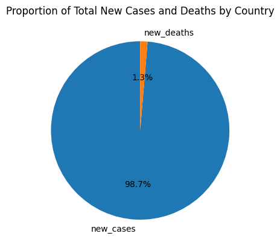
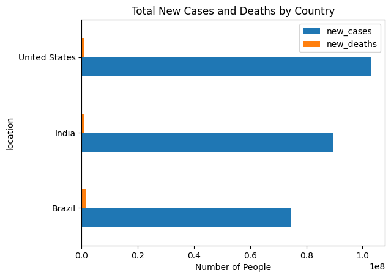
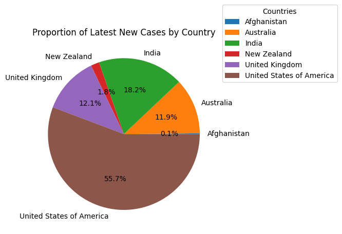
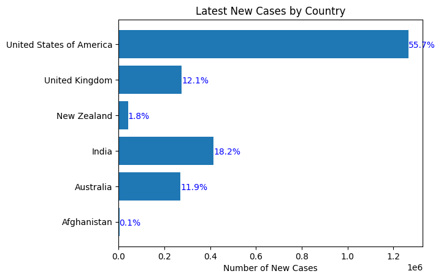

HW 7, CS 625, Spring 2022
================
Emmanuel Prem Kumar Gullipalli
Apr 13, 2023

# Homework 7: Project - Generate In-depth Questions Using EDA

## Dataset Exploration

### Description of datasets:

Main Dataset: The main dataset I have chosen is the “COVID-19 Deaths”
dataset from Our World in Data. This dataset contains information on the
cumulative number of deaths due to COVID-19 for different countries and
regions across the world, from the beginning of the pandemic until the
present day. The data is updated daily and can be accessed through the
following link:

<https://ourworldindata.org/covid-deaths>.

Second Dataset: The second dataset I have chosen is
“who-covid-19-global-data” dataset from the following link :

<https://covid19.who.int/WHO-COVID-19-global-data.csv>

“who-covid-19-global-data” dataset contains information related to
COVID-19 cases and deaths for different countries and regions across the
world. The column names and their descriptions are as follows:

- Date_reported: The date on which the data was reported
- Country_code: The code assigned to each country by the World Health
  Organization
- Location: The name of the country or region
- WHO_region: The region to which the country belongs according to the
  World Health Organization
- New_cases: The number of new confirmed cases of COVID-19 reported on
  the given date
- Cumulative_cases: The total number of confirmed cases of COVID-19 up
  to the given date
- New_deaths: The number of new deaths due to COVID-19 reported on the
  given date
- Cumulative_deaths: The total number of deaths due to COVID-19 up to
  the given date

## EDA Process:

In HW6, I started my EDA process by exploring the “COVID-19 Deaths”
dataset and identifying some initial questions related to the spread of
COVID-19 across different countries. Using this dataset, I found that
the number of deaths due to COVID-19 varied widely across different
countries and regions, and that the pandemic had disproportionately
affected certain populations, such as the elderly and those with
underlying health conditions.

### Initial Questions from HW6 :

1.  How has the spread of COVID-19 varied across different countries
    over time?

2.  What is the relationship between the number of COVID-19 cases and
    deaths in different countries?

### Exploring Secondary dataset :

I started explore secondary dataset in which data columns are
Date_reported,Country_code,location,WHO_region,New_cases,Cumulative_cases,New_deaths
and Cumulative_deaths.After analysing the data i have decide to combine
two datasets which have same columns and generate sepcific questions &
propose the charts for the questions for visual representation.

### Data Manipulation

To combine the columns which are common,i have written code in python
and concatenated two datasets common columns and formed 2 questions.

### Questions :

1.  What are the total new cases and deaths in the selected countries
    (United States, India, Brazil) and how do they compare?

2.  What is the latest number of new cases for each country in the
    selected group?

### Explanation of Proposed Charts:

I have written python code to generate the charts for the
questions.Below is the google colab link :

[Google Colab
Notebook](https://colab.research.google.com/drive/1FCNZIV-s1HX2Qcu5unI5KBvegWPx7-yO?usp=sharing)

Question 1 :

The first chart is a pie chart that shows the proportion of new cases
and deaths for each country among the selected countries of United
States, India, and Brazil. The second chart is a horizontal bar chart
that compares the new cases and deaths for each country among the
selected countries of United States, India, and Brazil.

The pie chart is suitable for showing the distribution of parts of a
whole, in this case, the proportion of new cases and deaths for each
country. The horizontal bar chart is useful for comparing the magnitude
of different categories or groups, in this case, the total new cases and
deaths for each country.

 \### Marks & channels:

- Marks: Pie chart
- Channels:
  - Color channel: Used implicitly by the pie chart to represent
    different categories (new cases and new deaths).
  - Angle channel: Used to represent the proportion of new cases and
    deaths for each country.
  - Label channel: Used to display the labels of the different
    categories (new cases and new deaths) and the percentage of each
    category.

 \### Marks & channels:

- Marks: Horizontal bar chart
- Channels:
  - Length channel: Used to represent the magnitude of the number of new
    cases and deaths for each country.
  - Color channel: Used implicitly by the bar chart to represent
    different categories (new cases and new deaths).
  - Label channel: Used to display the labels of the different
    categories (new cases and new deaths), and the labels of the
    different countries.

Question 2 :

The first chart, a pie chart, is used to show the proportion of new
cases for each country, with each country represented by a slice of the
pie. The percentage of new cases for each country is displayed using the
autopct parameter. A legend is added to the chart to identify the
countries represented.

The second chart, a horizontal bar chart, is used to compare the number
of new cases for each country. The countries are represented on the
y-axis, with the number of new cases represented on the x-axis. The bars
are colored blue, and the percentage of new cases for each country is
displayed next to the bar using the plt.text() function.

 \### Marks & channels:

- Marks: Pie chart
- Channels:
  - Color channel: Used implicitly by the pie chart to represent
    different categories (new cases for each country).
  - Angle channel: Used to represent the proportion of new cases for
    each country.
  - Label channel: Used to display the labels of the different countries
    and the percentage of new cases for each country.

 \### Marks & channels:

- Marks: Horizontal bar chart (rectangles) and text labels
- Channels:
  - Horizontal position on the x-axis represents the number of new
    cases.
  - Vertical position on the y-axis represents the countries.
  - Color (blue) is used for the text labels.
  - Text (percentage labels) is used to show the proportion of each
    country’s new cases out of the total.

Pie charts are useful when you want to show the proportional
relationship of different parts to a whole. In the context of data
visualization, pie charts are commonly used to show the distribution of
a categorical variable, such as the proportion of new cases by country
in the example provided. Pie charts are useful for quickly seeing which
categories have the largest or smallest proportion.

On the other hand, horizontal bar charts are useful when you want to
compare the size of different categories. In the context of data
visualization, horizontal bar charts are commonly used to compare the
numerical values of a set of categories, such as the number of new cases
by country in the example provided. Bar charts are useful for easily
comparing the values of different categories, and when you want to
display both positive and negative values.

### References

- Our World in Data (2023) COVID-19 Dataset :
  <https://ourworldindata.org/covid-deaths>

- <https://rmarkdown.rstudio.com/lesson-8.html>

- Global covid-19 Dataset:
  <https://covid19.who.int/WHO-COVID-19-global-data.csv>

- Wickham, H., & Grolemund, G. (2017). R for data science: import, tidy,
  transform, visualize, and model data. O’Reilly Media, Inc.
