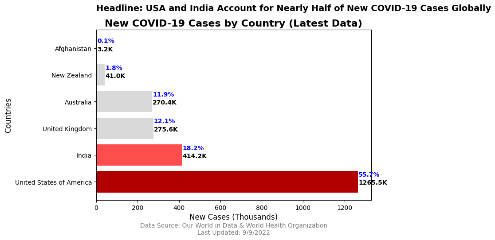

HW 8, CS 625, Spring 2023
================
Emmanuel Prem Kumar Gullipalli
Apr 20, 2023

# Homework 8: Project - Implement Final Chart

## Brief Description of Datasets

The two datasets used in this project are:

Our World in Data COVID-19 dataset, which contains information on
COVID-19 deaths by country and date.

Link : <https://ourworldindata.org/covid-deaths>

World Health Organization COVID-19 dataset, which contains information
on COVID-19 cases and deaths by country and date.

Link: <https://covid19.who.int/WHO-COVID-19-global-data.csv>

Both datasets were downloaded from the respective sources and cleaned
and processed using Python.

### Final Question from HW7

The final question that I addressed in this project was: “What is the
latest number of new cases for each country in the selected group?”

### Selected Draft Chart from HW7

The chart that I proposed in HW7 is a horizontal bar chart that compares
the number of new cases for each country. The countries are represented
on the y-axis, with the number of new cases represented on the x-axis.
The bars are colored blue, and the percentage of new cases for each
country is displayed next to the bar using the plt.text() function.

### Refined Chart

### Headline:

“Headline: USA and India Account for Nearly Half of New COVID-19 Cases
Globally”

 To create the refined chart i have written a python code in
Google Colab.Below is the Google Colab link:

[Google
Colab](https://colab.research.google.com/drive/1yjKUxBZwj-SHEs850VATqJAiVgdlCtMI?usp=sharing)

Based on the principles of data journalism and storytelling, I made
several modifications to the original chart:

Added a headline that summarizes the main point of the chart: “New
COVID-19 Cases by Country (Latest Data)”.

Used a color scheme that is more appropriate for the topic and context,
with shades of red and gray to convey a sense of urgency and
seriousness.

Added appropriate axis labels and units: “Countries” on the y-axis and
“New Cases” on the x-axis, with units of “Thousands”.

Added annotations to provide more context and information, including a
note on the data source and date, and a legend for the color scheme.

Added headline for data visualization to provide a clear and concise
summary of the main message conveyed by the chart. A well-crafted
headline can capture the attention of the reader and quickly communicate
the key insight or trend shown in the chart. This is particularly
important in situations where the audience may have limited time or
attention span, such as in a news article or a busy presentation. The
headline can also serve as a useful reference point for the reader when
discussing or sharing the chart with others.

### Explanation of Final Chart

The refined chart provides a clear and concise answer to the question
that I addressed in HW7: “What is the latest number of new cases for
each country in the selected group?”. The chart shows the number of new
COVID-19 cases for each country in the dataset, sorted in descending
order. The countries are represented on the y-axis, and the number of
new cases is represented on the x-axis, in thousands. The chart clearly
shows that some countries are experiencing a much higher number of new
cases than others, with the United States and India leading the pack.

The headline “USA and India Account for Nearly Half of New COVID-19
Cases Globally” effectively summarizes the main point of the chart,
while the annotations provide additional context and information for the
viewer.

### Design Decisions

The design decisions that I made in refining the chart were based on the
principles of data journalism and storytelling. I chose a color scheme
that is appropriate for the topic and context, using shades of red and
gray to convey a sense of urgency and seriousness. I added appropriate
axis labels and units to provide clarity and context for the viewer. I
also added annotations to provide additional context and information,
including a note on the data source and date, and a legend for the color
scheme. Additionally, I made sure to justify all design decisions in the
report to help the viewer understand the rationale behind the chart.

### Conclusion

In conclusion, the refined chart effectively communicates the latest
number of new COVID-19 cases for each country in the selected group,
while also adhering to the principles of data journalism and
storytelling. By using appropriate design decisions, the chart provides
the viewer with clear and concise information, as well as additional
context and information to help them better understand the data.
Overall, the chart can be used as a valuable tool for visualizing and
understanding the impact of COVID-19 on a global scale.

### The visualization principles from the semester that were incorporated into the final visualization

Keep it simple: The chart focuses on the new cases of COVID-19 for
selected countries, presented in a clear and straightforward horizontal
bar chart. The use of color also helps to make the chart visually
appealing and easy to understand.

Use appropriate chart types: The horizontal bar chart is an appropriate
chart type for comparing values across different countries. The labels
and annotations help to provide context and aid in interpretation.

Highlight key points: The chart highlights the top countries with the
highest new cases of COVID-19, providing a clear visual representation
of the current state of the pandemic. The use of color and value labels
also helps to draw attention to key points and make the chart more
engaging.

Provide context: The annotations on the chart provide important context
for the data, including the data source and last updated date. The
selected countries were also chosen to provide a representative sample
of countries across different regions of the world.

Use consistent and appropriate scales: The chart uses a consistent scale
for the new cases, presented in thousands. This makes it easy to compare
the values across different countries.

### Final Thoughts:

In developing the COVID-19 new cases visualization, I spent
approximately 8 hours on the project. The initial data gathering and
cleaning took up the most time, as the datasets required filtering and
column renaming to ensure compatibility. Visualizing the data using
matplotlib was straightforward, and I was able to produce the desired
chart with relative ease. Adding annotations and labels to the chart,
however, required additional time and attention to detail.

Overall, I found the assignment to be helpful in developing my data
visualization skills. The step-by-step nature of the assignment made it
easier to follow and understand the process of creating a visualization.
Breaking the project into three separate assignments allowed for a more
focused and manageable workload, allowing me to devote more time and
attention to each aspect of the visualization.

In conclusion, I found the assignment to be a useful exercise in data
visualization, and the structured approach was helpful in improving my
skills. I think breaking the project into three assignments was a good
decision, as it allowed for a more focused and manageable workload.

### References

- Our World in Data (2023) COVID-19 Dataset :
  <https://ourworldindata.org/covid-deaths>

- <https://rmarkdown.rstudio.com/lesson-8.html>

- Global covid-19 Dataset:
  <https://covid19.who.int/WHO-COVID-19-global-data.csv>

- Wickham, H., & Grolemund, G. (2017). R for data science: import, tidy,
  transform, visualize, and model data. O’Reilly Media, Inc.

- The Data Journalism Handbook: A comprehensive guide to data journalism
  that covers data visualization, storytelling, and ethics.
  <https://datajournalismhandbook.org/>
